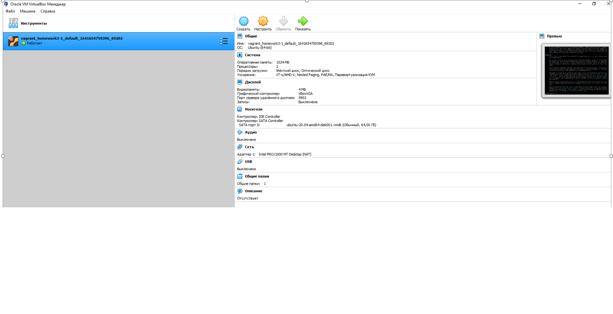
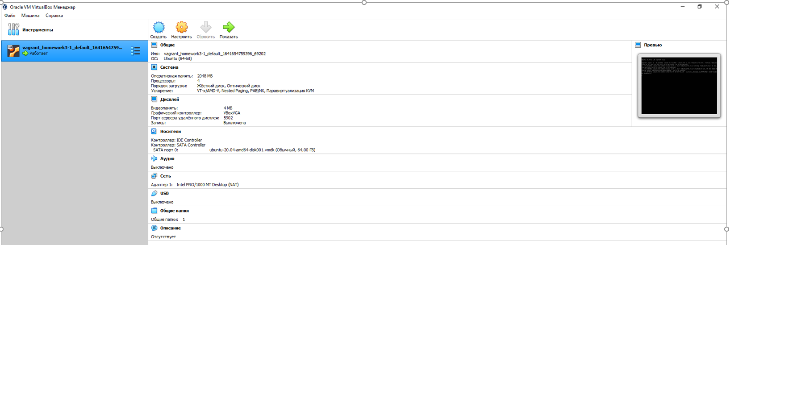

#_Домашнее задание занятию "3.1. Работа в терминале, лекция 1"_ #
##Выполнил  - Каплин Владимир ##


1. Проект Vagrant расположен в директории  C:\Users\kapli\vagrant_homework3-1.
Запускаем VM командой vagrant up
```
PS C:\Users\kapli\vagrant_homework3-1> vagrant up
Bringing machine 'default' up with 'virtualbox' provider...
==> default: Checking if box 'bento/ubuntu-20.04' version '202112.19.0' is up to date...
==> default: Clearing any previously set forwarded ports...
==> default: Clearing any previously set network interfaces...
==> default: Preparing network interfaces based on configuration...
    default: Adapter 1: nat
==> default: Forwarding ports...
    default: 22 (guest) => 2222 (host) (adapter 1)
==> default: Running 'pre-boot' VM customizations...
==> default: Booting VM...
==> default: Waiting for machine to boot. This may take a few minutes...
    default: SSH address: 127.0.0.1:2222
    default: SSH username: vagrant
    default: SSH auth method: private key
    default: Warning: Connection reset. Retrying...
    default: Warning: Remote connection disconnect. Retrying...
    default: Warning: Connection aborted. Retrying...
==> default: Machine booted and ready!
==> default: Checking for guest additions in VM...
==> default: Mounting shared folders...
    default: /vagrant => C:/Users/kapli/vagrant_homework3-1
==> default: Machine already provisioned. Run `vagrant provision` or use the `--provision`
==> default: flag to force provisioning. Provisioners marked to run always will still run.
```
2. Виртуальная машина стартовала с параметрами по умолчанию - 2 cores и 1024 мб оперативной памяти



3. Создадим виртуальную машину с увеличенными параметрами  - 4 cores и 2048 мб оперативной памяти
Для этого изменим файл Vagrantfile в директории C:\Users\kapli\vagrant_homework3-1 добавив следующий код:

```
config.vm.provider "virtualbox" do |v|
  v.memory = 2048
  v.cpus = 4
end
```
Остановим вирутальную машину командой vagrant halt и запустим командой vagrant init.
CPUs и RAM поменялись.



4. Применим команду vagrant ssh и подключимся к виртуальной машине 
```
PS C:\Users\kapli\vagrant_homework3-1> vagrant ssh
Welcome to Ubuntu 20.04.3 LTS (GNU/Linux 5.4.0-91-generic x86_64)

 * Documentation:  https://help.ubuntu.com
 * Management:     https://landscape.canonical.com
 * Support:        https://ubuntu.com/advantage

  System information as of Tue 11 Jan 2022 07:22:33 PM UTC

  System load:  1.19               Processes:             137
  Usage of /:   11.9% of 30.88GB   Users logged in:       0
  Memory usage: 9%                 IPv4 address for eth0: 10.0.2.15
  Swap usage:   0%


This system is built by the Bento project by Chef Software
More information can be found at https://github.com/chef/bento
Last login: Sun Jan  9 20:53:50 2022 from 10.0.2.2
vagrant@vagrant:~$
```
5. man bash 
   
- В разделе Shell Variables находим системную переменную HISTFILESIZE. 
   Переменная отвечает за кол-во строк истории вызова команд, которые 
   можно сохранить. Номер строки определяем с помощью опции -N определяем номер строки.
```
 621        HISTFILESIZE
    622               The maximum number of lines contained in the history file.  When this variable is assigned a value    622 , the history file is truncated, if necessary, to contain no more than that number of lines
    623               by removing the oldest entries.  The history file is also truncated to this size after writing it     623 when a shell exits.  If the value is 0, the history file is truncated to zero  size.   Non-
    624               numeric values and numeric values less than zero inhibit truncation.  The shell sets the default v    624 alue to the value of HISTSIZE after reading any startup files.
```
- ignoreboth является сокращением для переменных ignorespace и ignoredups. Используется в системной переменной HISTCONTROL.
ignoreboth находим следующим образом: man bash -> / -> вводим строку поиска "ignoreboth".

6. Ищем сценарии использования {}.
Нажимаем /, ищем по выражению \}
Находим два сценария: 1. использование в списке и расширение списка значений, массива с помощью фигурных скобок.
```
206        { list; }
    207               list  is  simply executed in the current shell environment.  list must be terminated with a newline or semicolon.  This is known as a group command.  The return status is the exit status
    207 of
    208               list.  Note that unlike the metacharacters ( and ), { and } are reserved words and must occur where a reserved word is permitted to be recognized.  Since they do not  cause  a  word  brea
    208 k,
    209               they must be separated from list by whitespace or another shell metacharacter.
793    Brace Expansion
  Brace  expansion is a mechanism by which arbitrary strings may be generated.  This mechanism is similar to pathname expansion, but the filenames generated need not exist.  Patterns to be brace e
    794 x‐
    795        panded take the form of an optional preamble, followed by either a series of comma-separated strings or a sequence expression between a pair of braces, followed by  an  optional  postscript.
```
7. Для создания 100 000 файлов командой touch можно применить команду {1, 100000).расширение файлов. 300 000 также можно создать ограничений не нашел в документации.
8. По поиску /\[\[  находим следующее описание:
```
 [[ expression ]]
              Return a status of 0 or 1 depending on the evaluation of the conditional expression expression.  Expressions are composed of the primaries described  below  under  CONDITIONAL  EXPRESSIONS.
              Word  splitting  and  pathname expansion are not performed on the words between the [[ and ]]; tilde expansion, parameter and variable expansion, arithmetic expansion, command substitution,
              process substitution, and quote removal are performed.  Conditional operators such as -f must be unquoted to be recognized as primaries.
```
Соответственно, выражение [[ -d /tmp ]]  вернет истину (1), если каталог /tmp существует. Ниже описание опции.
 ```
-d file
              True if file exists and is a directory.
```
9. Для добавления нового пути в $PATH при вызове команды type -a bash изменим файл .profile, добавив туда по аналогии строку 
```
# new_path_directory
PATH="/tmp/new_path_directory:$PATH"
```
Увидим, что переменная $PATH поменялась.
```
vagrant@vagrant:~$ echo $PATH
/tmp/new_path_directory:/usr/local/sbin:/usr/local/bin:/usr/sbin:/usr/bin:/sbin:/bin:/usr/games:/usr/local/games:/snap/bin
 ```
Далее создадим каталог /tmp/new_path_directory и скопируем двоичный файл bash туда 
```
vagrant@vagrant:/tmp$ mkdir new_path_directory
vagrant@vagrant:/tmp$ cd new_path_directory
vagrant@vagrant:/tmp/new_path_directory$ cp /usr/bin/bash /tmp/new_path_directory
```

Запустим команду type -a bash

```
vagrant@vagrant:/tmp/new_path_directory$ type -a bash
bash is /tmp/new_path_directory/bash
bash is /usr/bin/bash
bash is /bin/bash
 ```

10. Команда AT запланиует в заданный день\время команду и выполнит ее, команда batch выполнит задание, когда средней уровень 
загруженности системы будет ниже определенного значения.
Ниже справка
```
 at and batch read commands from standard input or a specified file which are to be executed at a later time, using /bin/sh
 batch   executes commands when system load levels permit; in other words, when the load average drops below 1.5, or the value specified in the invocation of atd.
 ```